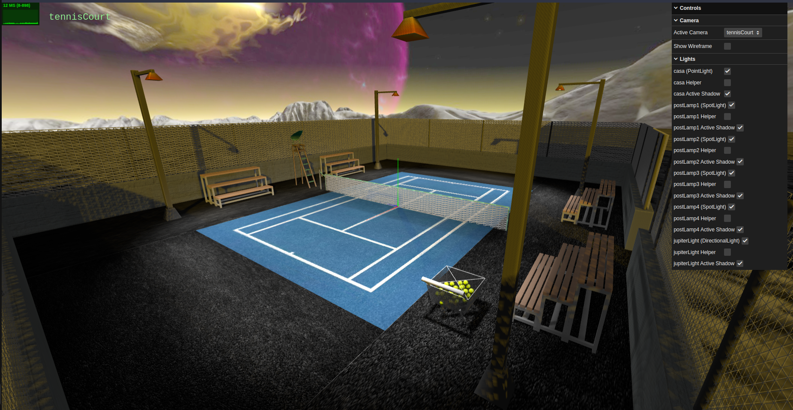
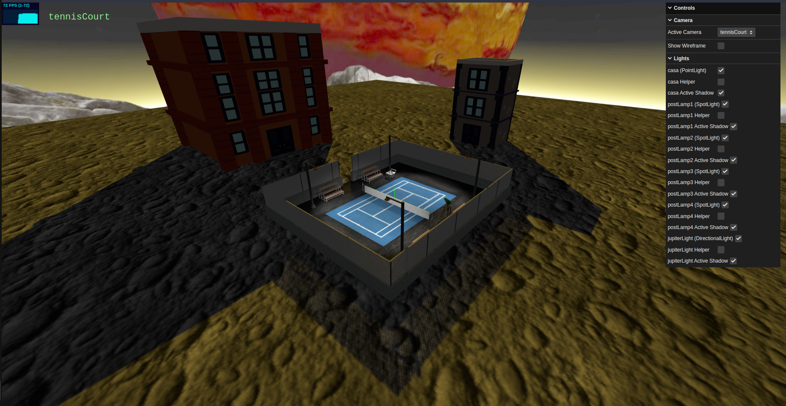
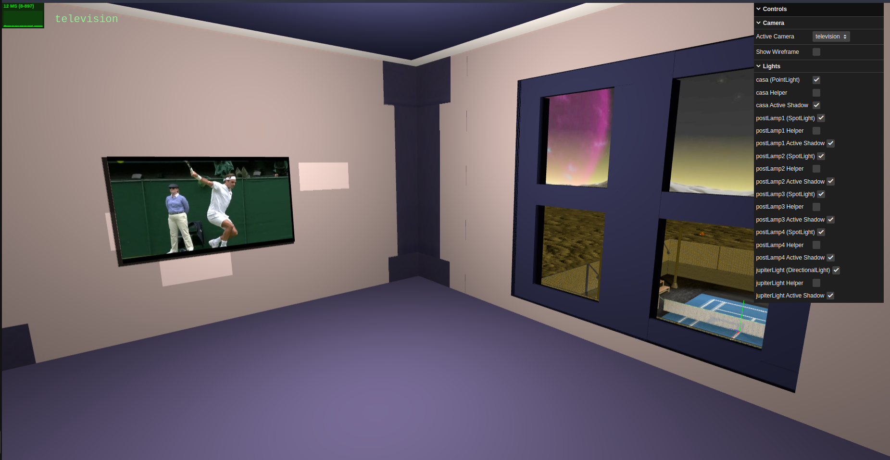

# A Tennis Court on a Distant Moon

## Team Members
| Name             |  E-Mail             |
| ---------------- | ------------------ |
| Afonso Baldo         |  up202004598@edu.fe.up.pt               |
| Rui Pires         | up202008252@edu.fe.up.pt      
## University
- [Faculty of Engineering of the University of Porto](https://sigarra.up.pt/feup/en/web_page.Inicial)

## Project Information
- This project was developed for the Interactive Graphics Systems course of the Master in Informatics and Computing Engineering at FEUP [(MIEIC-FEUP)](https://sigarra.up.pt/feup/en/cur_geral.cur_view?pv_curso_id=742&pv_ano_lectivo=2020).
- The project was developed using [Three.js](https://threejs.org/).
- The scene was written in yasf (Yet Another Scene Format) and converted to three.js using our own parser developed for this project, see [sceneBuilder.js](parser/SceneBuilder.js).
----
### How to run
  - Simply host the project directory in a web server and open it in a browser.
  - If you have live-server installed within vscode you can simply run the live server.
  - Or if you have python3 installed you can run the following command in the project directory to host a web server:
    - `python3 -m http.server 8000`
  - Then open the browser and go to `localhost:8000` to see the scene.
### Scene
  - Below are some screenshots of the scene:

  
  
  

### Features

- Skybox with the image of a space environment.
- Moon like floor with a bumptexture covering the entire scene.
- Tennis court centered in the origin surrounded by a cement floor.
- Net in the middle of the court with wireframe material.
- 4 lamps in the corners of the court using spotlights.
- 2 benches in the sides of the court.
- One shoppping cart near the court filled with tennis balls.
- Umpire chair in the middle of the court.
- Building in front of the court entrance is a level of detail object.
- Building in the back of the court has a video texture in the TV in the top floor.
- Jupiter like planet in the sky with a directional orange light.
- Every object casts and receives shadows.
- The court is surrounded by a fence that projects shadows in the moon like floor.

----
## Issues/Problems

- No issues/problems to report.
